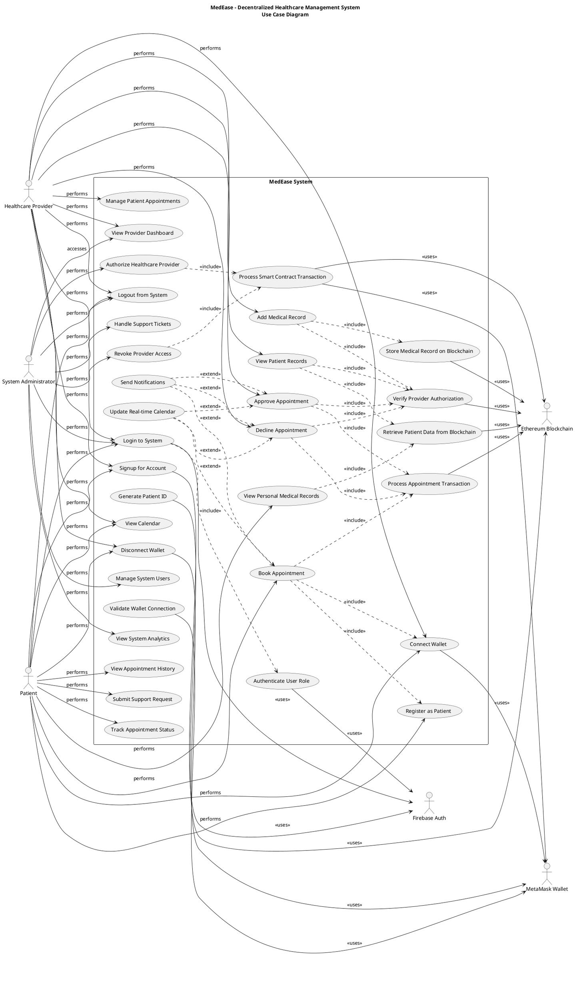

# MedEase - UML Use Case Diagram

## System: Decentralized Healthcare Management System (MedEase)

### Actors:
- **Patient** (Primary Actor)
- **Healthcare Provider** (Primary Actor)
- **System Administrator** (Primary Actor)
- **MetaMask Wallet** (External System)
- **Firebase Authentication** (External System)
- **Ethereum Blockchain** (External System)

---

## Use Case Diagram (PlantUML Format)

---

## Detailed Use Case Descriptions

### Authentication & Access Control

**UC1 - Login to System**
- **Actor:** Patient, Healthcare Provider, System Administrator
- **Description:** User authenticates using email/password or Google OAuth
- **Preconditions:** User has valid account credentials
- **Flow:** User enters credentials → Firebase validates → Role determined → Dashboard accessed
- **Postconditions:** User is authenticated and redirected to role-specific dashboard

**UC4 - Connect Wallet**
- **Actor:** Patient, Healthcare Provider
- **Description:** User connects MetaMask wallet for blockchain operations
- **Preconditions:** MetaMask installed, user authenticated
- **Flow:** User clicks connect → MetaMask prompts → Wallet connected → Smart contract access enabled
- **Postconditions:** Wallet connected, blockchain operations available

### Patient Operations

**UC7 - Book Appointment**
- **Actor:** Patient
- **Description:** Patient schedules appointment with healthcare provider
- **Preconditions:** Patient registered, wallet connected
- **Flow:** Patient fills form → Wallet transaction → Smart contract records → Provider notified
- **Postconditions:** Appointment stored on blockchain, pending provider approval

**UC8 - View Personal Medical Records**
- **Actor:** Patient
- **Description:** Patient accesses their medical history from blockchain
- **Preconditions:** Patient authenticated, wallet connected
- **Flow:** Patient requests records → Smart contract queries → Records retrieved → Displayed
- **Postconditions:** Patient views complete medical history

### Healthcare Provider Operations

**UC13 - Approve Appointment**
- **Actor:** Healthcare Provider
- **Description:** Provider approves pending patient appointment
- **Preconditions:** Provider authorized, appointment exists, wallet connected
- **Flow:** Provider reviews → Clicks approve → Wallet transaction → Smart contract updates → Patient notified
- **Postconditions:** Appointment approved, status updated on blockchain

**UC15 - Add Medical Record**
- **Actor:** Healthcare Provider
- **Description:** Provider adds new medical record for patient
- **Preconditions:** Provider authorized, patient exists, wallet connected
- **Flow:** Provider enters diagnosis/treatment → Wallet transaction → Smart contract stores → Record immutable
- **Postconditions:** Medical record permanently stored on blockchain

### Administrative Operations

**UC19 - Authorize Healthcare Provider**
- **Actor:** System Administrator
- **Description:** Admin grants provider access to system
- **Preconditions:** Admin is contract owner, provider wallet address known
- **Flow:** Admin enters provider address → Smart contract transaction → Provider authorized
- **Postconditions:** Provider can access patient data and perform medical operations

### Blockchain Operations

**UC24 - Store Medical Record on Blockchain**
- **Actor:** System (triggered by UC15)
- **Description:** Medical record data is permanently stored on Ethereum
- **Preconditions:** Valid medical record data, authorized provider
- **Flow:** Smart contract validates → Data stored → Event emitted → Frontend updated
- **Postconditions:** Immutable medical record created with timestamp

**UC26 - Process Appointment Transaction**
- **Actor:** System (triggered by UC7, UC13, UC14)
- **Description:** Appointment data processed through smart contract
- **Preconditions:** Valid appointment data, sufficient gas fees
- **Flow:** Transaction submitted → Blockchain validates → State updated → Event emitted
- **Postconditions:** Appointment status updated on blockchain

---

## Use Case Relationships

### Include Relationships:
- **Book Appointment** includes **Connect Wallet**, **Register as Patient**, **Process Appointment Transaction**
- **Add Medical Record** includes **Verify Provider Authorization**, **Store Medical Record on Blockchain**
- **View Patient Records** includes **Retrieve Patient Data from Blockchain**, **Verify Provider Authorization**

### Extend Relationships:
- **Update Real-time Calendar** extends appointment-related use cases
- **Send Notifications** extends appointment status changes

### Dependencies:
- All blockchain operations depend on **MetaMask Wallet** connectivity
- Authentication operations depend on **Firebase Authentication**
- Medical data operations depend on **Ethereum Blockchain**

---

## Notes:
1. This diagram represents the core functionality of the MedEase system
2. All medical data operations require blockchain connectivity
3. Role-based access control is enforced throughout the system
4. External systems (Firebase, MetaMask, Ethereum) are essential for system operation
5. The system ensures patient data ownership through blockchain technology
